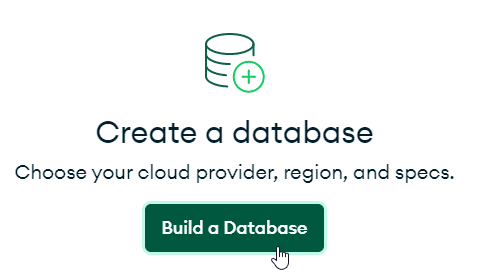
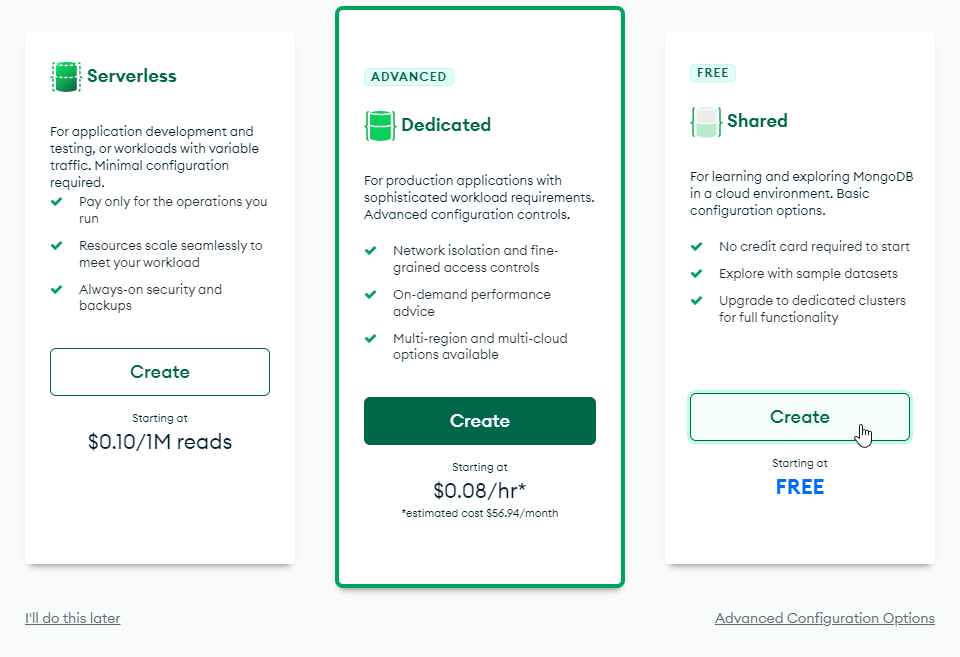

# MongoDB - Creating a Cluster using Atlas
Follow these instructions to set up a database for your project. You will want to go to the [Get Started with Atlas](https://www.mongodb.com/docs/atlas/getting-started/) guide and follow those instructions.

## Create an Atlas account
Start by creating an account in MongoDB Atlas.

1. [Go here](https://www.mongodb.com/cloud/atlas/register)
1. Fill out the First Name, Last Name, Email, and Password fields, or Sign Up with Google
1. Agree to the terms and service and submit

## Deploy a free cluster
Now that you have an account, it's time to make a cluster - this is where the database lives.

1. From the [homepage](https://cloud.mongodb.com/), click "Build a Database"  
  
1. Find the **FREE** Shared option and click "Create"  
  
1. Keep all the default settings, scroll down, and click "Create Cluster"  
  

## Set up the cluster
Now that the cluster has been created, you will need to setup access rules.

1. Under "Security Quickstart" with "Username and Password" selected, enter a username and password  
  - Feel free to use the "Autogenerate Secure Password" button - just make sure to copy/remember the password!
1. Click "Create User"  
  
1. Scroll down to the "Where would you like to connect from?" section
1. Click the "Add My Current IP Address" button  
  
1. Click the "Finish and Close" button  
  
1. In the popup, click the "Go to Databases" button  
  

## Get a connection string
Now the database should be ready to go! You just need a special URL to connect your application to it.

1. In the "Cluster0" deployment click the "Connect" button  
  
1. In the popup that appears, click the "Connect your application" button  
  
1. Make sure "Node.js" is selected as the driver
1. Click the copy button next to the connection string  
  

## Make a `.env` file
Now all that's left is putting the string into a **.env** file.

1. In VS Code, create a new file named **.env**
  - For the Blue group, this file should be in the **student-profiles**
  - For the Yellow group, this file should be in the **back-end** folder
1. In that file, add `MONGO_URI=""`
1. Paste in the copied connection string between the `"` and `"`
1. Replace `<password>` with the password for the user you created (make sure to get rid of the `<` and `>`)

That should be it! You should now be able to connect to your MongoDB Database from the application.

### Side-note: Yellow Group
Members of the Yellow Group will also want to add another line to their **.env** file:

```
SECRET_KEY="<somesecretthing>"
```

Anything can go between those quotes - it should not really matter.